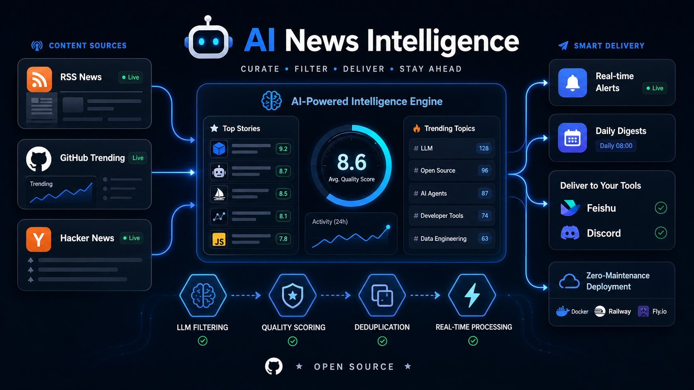

# News Agent

News Agent is a local, personal news service. It collects RSS feeds, built-in signal sources, GitHub Trending, and Hacker News, uses an OpenAI-compatible LLM to rank and summarize items, and delivers digests to Feishu or Discord.

It runs on macOS, Windows, and Linux. A local web console, HTTP API, and stdio MCP server all manage the same configuration and jobs.



## Features

- Aggregate RSS feeds, GitHub Trending, Hacker News, Product Hunt, Reddit, App Store new apps, V2EX, 36Kr, Sspai, OSChina, Jike topics, and other built-in signal sources.
- Rank, filter, deduplicate, and summarize content with an LLM.
- Add, update, verify, and remove RSS sources from the web console, API, or MCP.
- Set interests, exclusions, source weights, delivery times, and item limits.
- Run scheduled fetches and deliveries, or trigger them manually.
- Deliver to Feishu, Discord, or a custom HTTP endpoint.
- Keep configuration, logs, and job history in the local user-data directory.
- Bind the local control plane to `127.0.0.1:12301` by default.

## Requirements

- macOS, Windows, or Linux
- [uv](https://docs.astral.sh/uv/)
- An API key for an OpenAI Chat, OpenAI Responses, or Anthropic Messages endpoint

The installer scripts for macOS, Linux, and Windows will automatically install `uv` for the current user if it is not already available.

## Install

You can install News Agent using a single terminal command without cloning first:

macOS or Linux:

```bash
curl -fsSL https://raw.githubusercontent.com/huawolf/news-agent/main/scripts/install.sh | bash
```

Windows PowerShell:

```powershell
iwr -useb https://raw.githubusercontent.com/huawolf/news-agent/main/scripts/install.ps1 | iex
```

The installer creates `.env` from `.env.example`, installs the locked runtime dependencies, registers a per-user login service, and restarts that service so repeated installs immediately run the updated code. Open <http://127.0.0.1:12301> after installation.

## Configure

Configure the model, endpoint, protocol, API key, and delivery webhooks in the
**Model and delivery settings** section of the local web console. The fields
save automatically and the model connection can be tested in place. Keep the
console private because it displays configured secret values.

Secrets are stored in `.env`. Model settings, preferences, and delivery
schedules are stored in `config.json` through the validated local API. The LLM
key variable in `.env` must match `llm.apiKeyName`; the default configuration
uses `DEEPSEEK_API_KEY`.

```dotenv
DEEPSEEK_API_KEY=your_llm_api_key
FEISHU_WEBHOOK_URL=https://open.feishu.cn/open-apis/bot/v2/hook/...
# DISCORD_WEBHOOK_URL=https://discord.com/api/webhooks/...
```

When using another key variable, such as `OPENAI_API_KEY` or
`ANTHROPIC_API_KEY`, set `llm.apiKeyName` to the same name through the local API.
After editing `.env` directly, restart the service from the project directory:

```bash
uv run news-agent service restart
```

The first service start creates `config.json` from
[config.json.example](config.json.example). Use the web console or local API to
manage model settings, feeds, preferences, and schedules instead of replacing
the active configuration file.

Optional source integrations can also use `.env` credentials. Product Hunt,
for example, uses `PH_TOKEN` when configured and falls back to its public feed
when the token is absent.

Important settings:

- `preferences`: interests, exclusions, source weights, language preference, and diversity limits.
- `llm`: model, endpoint, API-key environment variable, and protocol. The Web
  console detects OpenAI Chat Completions, OpenAI Responses, or Anthropic
  Messages from the endpoint and model name, allows manual override, and can
  save and test the current connection.
- `sections.signals`: built-in signal adapters for Product Hunt, Reddit fallback, GitHub variants, V2EX, RSSHub topics, App Store regions, and domestic RSS sources.
- `schedule.fetch_lookback_minutes`: fetch lookback window; defaults to 1440 minutes so built-in signals only keep the last 24 hours, except daily ranking pages such as GitHub Trending.
- `log.retention_days`: number of daily log directories to retain; defaults to 30 days.
- `delivery.schedules`: cron schedules, sections, and the combined RSS/Hacker News `max_items` limit per delivery. GitHub uses its own section limit.
  Without an explicit schedule, deliveries default to 10:00 and 20:00 daily,
  with at most 10 news items each time.
- `delivery.immediate`: high-score alert threshold and daily limit.
- `push`: enable Feishu, Discord, or a custom endpoint.

## Run

Use `uv run news-agent` for all commands:

```bash
uv sync                         # Install development dependencies
uv run news-agent check         # Check LLM connectivity
uv run news-agent fetch         # Fetch and score once
uv run news-agent push          # Generate and send one digest
uv run news-agent serve         # Run the local web/API service
uv run news-agent mcp           # Run the stdio MCP server
uv run news-agent service status
```

The `serve` command starts the built-in scheduler and the local API at <http://127.0.0.1:12301>. Interactive API documentation is available at <http://127.0.0.1:12301/docs>.

To remove the login service without deleting data:

```bash
./scripts/uninstall.sh
```

On Windows:

```powershell
powershell -ExecutionPolicy Bypass -File .\scripts\uninstall.ps1
```

## Local API and MCP

The local API supports configuration, source, delivery, job, and log operations. Set `NEWS_AGENT_LOCAL_TOKEN` in `.env` to require the `X-News-Agent-Token` header for API requests.

The MCP server is intended for a local agent process:

```json
{
  "command": "uv",
  "args": ["run", "news-agent", "mcp"],
  "cwd": "/path/to/news-agent"
}
```

Available MCP tools include source management, preference and schedule updates, manual fetch/push jobs, digest previews, job status, and recent logs. `run_push` requires explicit confirmation.

AI agents performing installation or initial configuration should follow the
[News Agent Operator skill](SKILL.md). It defines the
non-browser workflow for secret handling, API configuration, service restart,
health checks, model testing, previews, and confirmed delivery.

## Data and Logs

Runtime data is stored in the project directory by default:

| Type | Directory |
| --- | --- |
| News data | `news-data/` |
| Logs | `logs/` |
| Job records | `runs/` |

Use `NEWS_AGENT_DATA_DIR` or `NEWS_AGENT_CONFIG` to override these paths. Application logs use rotating files; the project does not depend on system journals.

## Security

News Agent binds to loopback by default. Do not expose the local API to an untrusted network. Keep `.env`, webhook URLs, and API keys out of version control.

## Contributing

Issues and pull requests are welcome. Please keep changes focused, add tests for behavior changes, and update the relevant documentation when configuration or user-facing behavior changes.

## License

This project is licensed under the [MIT License](LICENSE).
