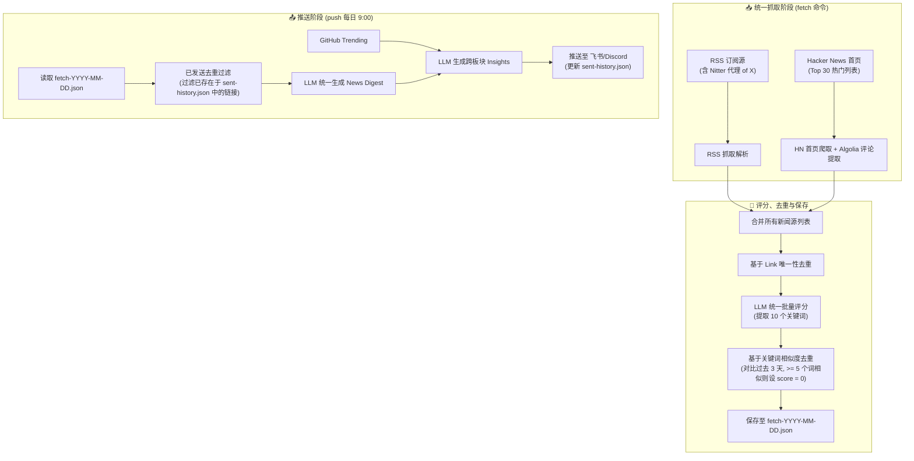

# 新闻聚合系统架构升级设计方案 (Unified News Sources & Scoring Design)

本方案旨在进行系统的架构升级，将 **Hacker News**、**RSS 订阅源** 以及 **X/Twitter 平台** 统一整合为底层的“新闻来源”；简化打分规则，引入基于 `.env` 配置的“个人兴趣偏好”打分；并将“来源”作为新闻质量评估的依据之一。

---

## 1. 架构升级：统一新闻来源 (Unified News Sources)

### 1.1 统一 Fetch & Store 流程
所有新闻（RSS 订阅、X 平台推文、Hacker News 热帖）统一在 `fetch` 阶段（`run_fetch_job`）抓取，并生成标准化的新闻条目（`News Entry`），经去重和批量评分后保存至 `news-data/fetch-YYYY-MM-DD.json`。



### 1.2 Hacker News Fetcher 设计 (不使用 Jina Reader)
* **抓取目标**：爬取 HN 首页 `https://news.ycombinator.com/news`，解析出前 30 条 story 的元数据（`id`, `title`, `url`, `points`, `comments` 等）。
* **富文本处理**：
  对于这 30 条 story，并发调用 Algolia API (`https://hn.algolia.com/api/v1/items/{item_id}`) 获取详细数据：
  1. 如果是 Ask HN/Show HN 等无外链帖子，提取帖子的正文文本（`text`）。
  2. 获取热门评论树中前 5 条顶层（L1）评论。过滤掉空评论，将评论 HTML 转换为 Markdown。
  3. 将这些内容格式化并拼装为 entry 的 `content` 字段。
* **数据格式**：
  ```json
  {
    "title": "Show HN: Some open-source AI project",
    "link": "https://news.ycombinator.com/item?id=xxxx", 
    "published": "2026-07-18T04:00:00Z",
    "source": "Hacker News",
    "content": "Domain: github.com/user/project\nPoints: 120 | Comments: 25\n\n[Top Comments]\n- User A: This is a great tool, especially the caching layer...\n- User B: How does this compare to project Y?...\n- User C: It seems to have a security flaw in line 45..."
  }
  ```

### 1.3 X/Twitter 平台处理
* 保持现有通过 Nitter / Xcancel 实例的 RSS 抓取逻辑，并被 `merge_sources` 统一作为标准 RSS 导入。
* 在 RSS entry 解析中，解析出的 title 包含推特账号标识（如 `Elon Musk(@elonmusk)`），该标识作为 entry 的 `source` 传递给 LLM。

---

## 2. 评分规则简化与偏好打分

### 2.1 环境变量配置 (`.env`)
新增配置个人偏好关键字：
```bash
# 个人兴趣偏好，用以加权打分 (如：创业项目、隐含股票等投资机会、AI关键进展)
PERSONAL_PREFERENCES="创业项目、隐含股票等投资机会、AI关键进展"
```

### 2.2 打分维度
LLM 评分器接收 `{preferences}` 变量，在对每条 Entry 进行评分时，评估并输出以下字段：
1. **基础质量分 (`quality_score` 0-100)**：
   * **来源 (Source) 权重**：官方/创始人一手渠道（如 OpenAI 官博、知名项目创始人推特）基础分定为 85+；高质量专业社区/媒体（如 Hacker News 热帖、TechCrunch 原创）基础分定为 75+；二手转述或 KOL 转发基础分定为 <70。
   * **信息量与时效性**：剔除纯情绪宣泄和广告软文。
2. **用户兴趣匹配分 (`interest_score` 0-100)**：
   * 严格对照 `.env` 中配置的个人偏好进行匹配（如是否有潜在商业股票价值、是否是新创业项目、是否是 AI 关键技术进展）。
3. **最终总分 (`score` 0-100)**：
   * 综合 `quality_score` 与 `interest_score`，由 LLM 结合两者算出一个统一的推荐总分。低于 `min_score` (默认 60 分) 的新闻将不予推送。

### 2.3 LLM 返回 Schema 升级
`prompts/score_batch.md` 的输出格式简化为：
```json
{
  "items": [
    {
      "link": "https://news.ycombinator.com/item?id=xxxx",
      "score": 92,
      "quality_score": 85,
      "interest_score": 96,
      "tags": ["AI翻译", "独立开发", "MRR"],
      "keywords": ["GPT-4o", "翻译工具", "独立开发者", "MRR", "订阅模式", "出海", "创业项目", "5万美元", "多语言", "软件工程"],
      "summary": "一款独立开发的AI翻译工具通过月度订阅实现MRR稳定在5万美元。"
    }
  ]
}
```

### 2.4 新闻输出内容简化 (极简排版)
为了使推送早报与快讯更加凝练，降低阅读负荷，对生成端（`prompts/digest.md` 和 `prompts/immediate_push.md`）的新闻输出进行重度简化，**仅保留 1）标题 和 2）摘要，其余所有附带内容（如来源、原文链接、多点无序列表、Why it matters 深度分析）一律丢弃**：

1. **早报新闻条目输出格式**：
   ```markdown
   ### 1. [新闻标题]
   [一整段简洁的新闻摘要内容，交代核心事实，不再展开无序列表，不再附带链接和来源]
   ```
2. **即时快讯条目输出格式**：
   ```markdown
   ## [突发新闻标题]
   [一整段简洁的快讯摘要内容，不再提供来源、事实列表、Why it matters 深度洞察以及外链]
   ```


## 3. 内容与发送双层去重机制

为了绝对避免重复内容的发送，系统采用“内容相似去重”与“已发送历史去重”的双层控制。

### 3.1 核心一：基于关键词的相似度去重 (滑窗 3 天)
1. **LLM 关键词提取**：在 `prompts/score_batch.md` 中，LLM 为每一条新闻精确提取 **10 个关键词**（`keywords` 字段）。
2. **关键词相似度匹配算法**：
   * 对关键词清洗标准化（小写，剔除空格和特殊连字符）。
   * 判定两个词相似：完全相同，或长度 $\ge 3$ 且包含（如 `openai` 与 `openai公司`）。
3. **判定与处置**：
   新抓取的新闻与过去 3 天历史已存的新闻中任意一条相比，若有 **$\ge 5$ 个关键词相似**，则将新条目 `score` 置为 `0`，标记为 `is_duplicate = true`。

比对算法的 Python 实现如下：
```python
def is_keyword_match(k1: str, k2: str) -> bool:
    """判定两个关键词是否相似/匹配"""
    k1_clean = "".join(c for c in k1.lower() if c.isalnum())
    k2_clean = "".join(c for c in k2.lower() if c.isalnum())
    
    if not k1_clean or not k2_clean:
        return False
        
    if k1_clean == k2_clean:
        return True
        
    if len(k1_clean) >= 3 and len(k2_clean) >= 3:
        if k1_clean in k2_clean or k2_clean in k1_clean:
            return True
            
    return False

def count_overlapping_keywords(keywords_a: list[str], keywords_b: list[str]) -> int:
    """计算两组关键词中重合的数量"""
    matches = 0
    matched_in_b = set()
    
    for k_a in keywords_a:
        for k_b in keywords_b:
            if k_b not in matched_in_b and is_keyword_match(k_a, k_b):
                matches += 1
                matched_in_b.add(k_b)
                break
                
    return matches
```

### 3.2 核心二：已发送去重机制 (包括即时快讯)
为确保**已经通过即时快讯发送的高分新闻，在定时早报中不会被重复发送**：

1. **建立发送账本**：
   在 `news-data/` 目录下维护一个极简的已发送历史索引文件 `sent-history.json`，存储已成功发送的新闻链接及时间戳：
   ```json
   {
     "https://example.com/pushed-article-url": "2026-07-18T12:00:00.000000"
   }
   ```
2. **记账时机**：
   * **即时快讯发送成功后**：将本次即时推送的所有高分新闻 `link` 写入 `sent-history.json`。
   * **定时早报推送成功后**：将本次早报中实际推送的 `to_push` 列表内的所有新闻 `link` 写入 `sent-history.json`。
3. **早报生成时的去重过滤**：
   * 修改 `collect_entries_for_push` 函数。在加载近期的候选新闻时，先载入 `sent-history.json` 中保存的已发送链接集合。
   * 强行将 `to_push` 列表中所有已发送的链接剔除。
4. **账本自动维护**：
   * 每次读取或写入 `sent-history.json` 时，自动清理超过 3 天的历史记录，保证文件小巧、运行高效。

---

## 4. 调度配置更新与版面简化

### 4.1 9:00 单次推送
在 `config.json` 中配置 `schedule`：
```json
{
  "schedule": {
    "fetch_interval_minutes": 60,
    "fetch_lookback_minutes": 120,
    "push_cron": ["0 9 * * *"],
    "timezone_hours": 8
  }
}
```

### 4.2 板块简化
* 在 `config.json` 中，将 `sections.hackernews.enabled` 设为 `false`。
* 移除原有的独立 `hackernews` 章节，所有的 Hacker News 高分帖子统一在 News 板块中展示。

---

## 5. 改造实施路线 (Implementation Checklist)

1. [x] **Step 1: 环境变量与配置加载**
   - 修改 `src/config.py`，加载并导出 `PERSONAL_PREFERENCES` 环境变量。
   - 更新 `config.json` 的 `push_cron` 为 `["0 9 * * *"]`，并将 `sections.hackernews.enabled` 置为 `false`。
2. [x] **Step 2: Hacker News Fetcher 实现**
   - 在 `src/fetcher.py` 引入 `fetch_hackernews_entries` 方法：
     - 调用 `src/sections/hackernews/frontpage_scraper.py` 获取 top 30 stories。
     - 异步并发请求 Algolia 接口获取 comments 和 post text。
     - 拼装 content 生成 News Entry 字典。
3. [x] **Step 3: `run_fetch_job` 统一合并与过滤**
   - 在 `src/main.py` 的 `run_fetch_job` 中，同时并发运行 RSS fetch 和 HN fetch.
   - 基于 Link 进行统一去重，并将合并后的 Entry 传递给 LLM 批量评分。
4. [x] **Step 4: Prompts 与评分器改造**
   - 重构 `prompts/score_batch.md` 模版，简化打分要求，加入 `{preferences}` 变量，并明确输出 10 个关键词的 `keywords` 字段。
   - 修改 `src/llm.py` 中的 `score_batch` 及 `_merge_scores` 函数，支持传入 `{preferences}` 并解析保存 `quality_score`、`interest_score` 和 `keywords` 字段。
5. [x] **Step 5: 关键词去重与已发送去重机制实现**
   - 在 `src/storage.py` 中实现 `load_sent_links(days, data_dir)` 和 `mark_links_as_sent(links, data_dir)`。
   - 在 `src/main.py` 的 `collect_entries_for_push` 中增加对已发送链接的强行过滤。
   - 在 `run_fetch_job` 快讯推送成功及 `_run_morning_push`/`_run_default_push` 早报推送成功后，调用 `mark_links_as_sent` 记录已发链接。
   - 实现 `deduplicate_by_keywords(new_entries, config)` 函数并在 `run_fetch_job` 中调用，对关键词重合 $\ge 5$ 个的条目将其分数置零。
6. [x] **Step 6: 本地测试运行**
   - 运行本地命令验证抓取、打分和推送是否符合预期。
